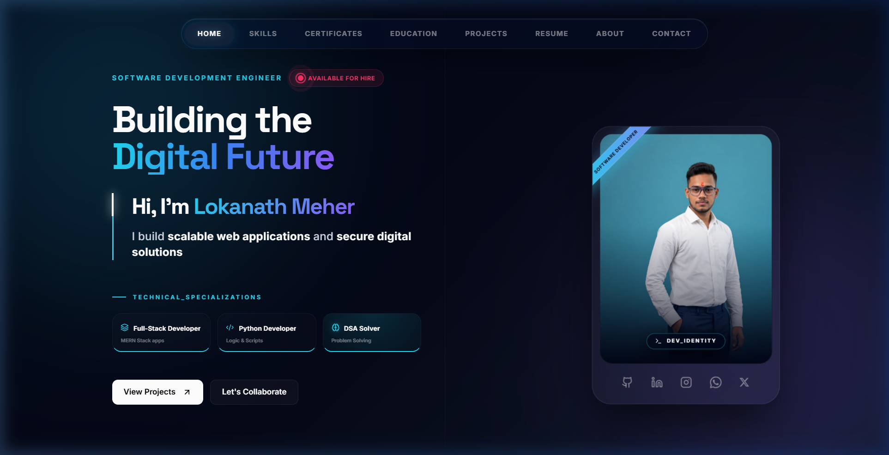
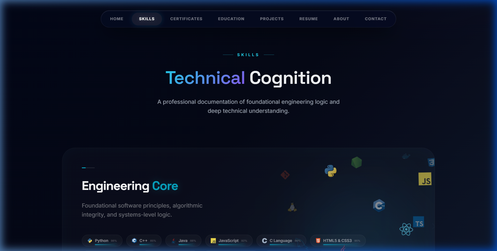
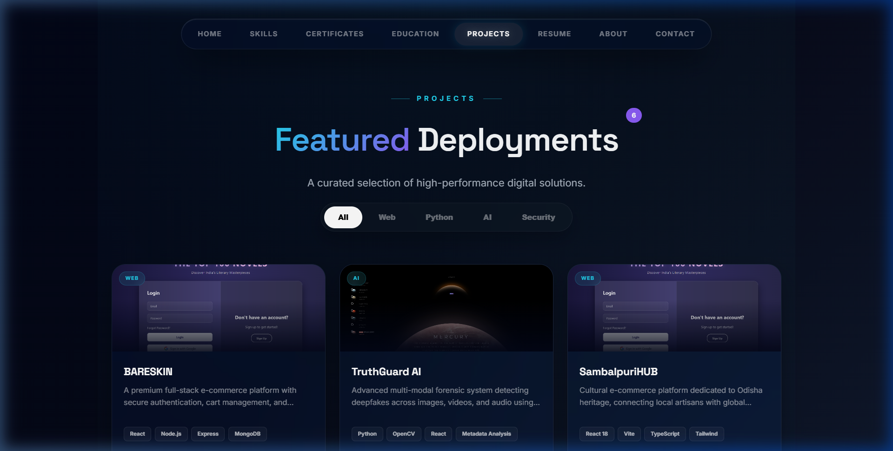
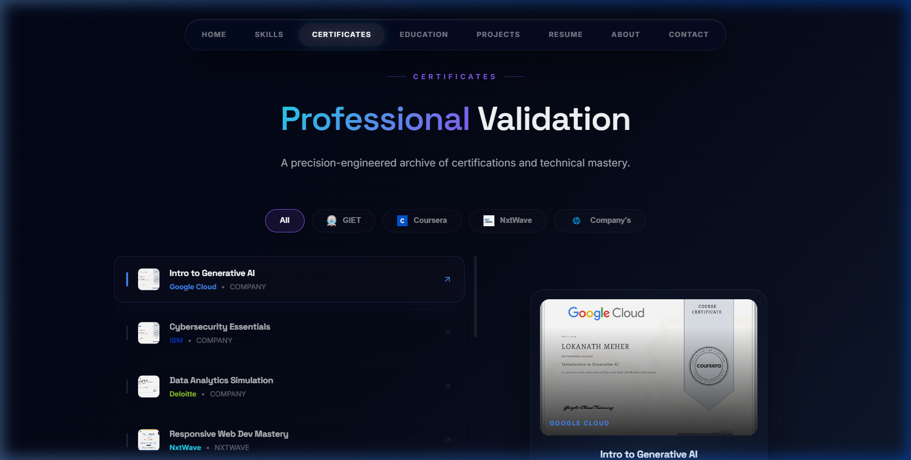

# 💻 Lokanath Meher | Software Development Engineer

A detail-oriented **Computer Science & Engineering** undergraduate at **GIET Bhubaneswar** (8.5 CGPA). Passionate about building full-stack applications with the **MERN** stack, writing **Python** automation scripts, and exploring **cybersecurity** fundamentals.

[**✨ Interactive Portfolio**](https://lokanathmeher19.github.io) • [**💼 View Resume**](public/Lokanath_Meher_Resume.pdf) • [**📬 Let's Connect**](https://wa.me/919937164359)

---

## 📸 Portfolio Showcase

<table width="100%">
  <tr>
    <td width="50%" align="center"><b>💻 Hero Section (Home)</b></td>
    <td width="50%" align="center"><b>🛠️ Technical Skills Grid</b></td>
  </tr>
  <tr>
    <td></td>
    <td></td>
  </tr>
  <tr>
    <td width="50%" align="center"><b>📁 Projects Showcase</b></td>
    <td width="50%" align="center"><b>📜 Filterable Certifications</b></td>
  </tr>
  <tr>
    <td></td>
    <td></td>
  </tr>
</table>

---

## 🎓 Education & Experience

### 🏫 Education
*   **B.Tech in Computer Science & Engineering** | *GIET Bhubaneswar* | **2024 — 2028** (Current: 8.5 CGPA)
*   **Higher Secondary (Class XII - Science)** | *Dadhi Baman HS School* | **2022 — 2024**
*   **Secondary (Class X)** | *Sri Aurobindo Institute* | **2019 — 2022**

### 💼 Experience
*   **Python Programming Intern** @ [Codec Networks](https://www.codecnetworks.com) | *June 2023 — August 2023*
    *   Developed Flask APIs, SQL database integrations, and automated workflows, reducing manual operations by **30%**.

---

## 🛠️ Technical Skills

- **Languages:** Python, C++, Java, JavaScript, C, SQL
- **Web Development:** React, Node.js, Express.js, MongoDB, Next.js, TypeScript, Tailwind CSS, Redux
- **Tools & DevOps:** Git, Docker, AWS, Supabase, Netlify, Kali Linux

---

## 📂 Featured Projects

### 🛍️ [BARESKIN](https://github.com/lokanathmeher19/BARESKIN)
A premium, full-stack MERN e-commerce platform featuring secure local authentication, modular cart state management, and modern animations.

### 🛡️ [TruthGuard AI](https://github.com/lokanathmeher19/TruthGuard_AI)
A computer-vision and deepfake analysis application that inspects video/image frames to detect synthetic manipulation in real-time.

### 🧶 [SambalpuriHUB](https://github.com/lokanathmeher19/sambalpuriHUB)
A responsive cultural-heritage commerce platform for handloom weavers in Odisha, built using GSAP animations and Tailwind CSS.

### ⚡ [Internet Speed Test](https://github.com/lokanathmeher19/Internetspeed_Test)
A containerized (Docker) network utility application designed to run latency checks, download speed, and upload throughput tests.

---

## 📜 Key Certifications

- **IBM** — Cybersecurity Essentials (2025)
- **Cisco** — Introduction to Cybersecurity (2025)
- **Google Cloud** — Intro to Generative AI (2025)
- **Deloitte** — Data Analytics Virtual Experience (2025)
- **Google** — Gemini AI Academy (2025)

---

## ⚙️ Local Development (Portfolio Site)

To run this portfolio repository locally:

```bash
# 1. Clone & Install
git clone https://github.com/lokanathmeher19/lokanathmeher19.github.io.git
cd lokanathmeher19.github.io
npm install

# 2. Add local configuration in .env
# VITE_EMAILJS_SERVICE_ID=...
# VITE_EMAILJS_TEMPLATE_ID=...
# VITE_EMAILJS_PUBLIC_KEY=...

# 3. Start Development Server
npm run dev
```

---

## 📬 Let's Connect!

- **📧 Email:** [meherlokanath314@gmail.com](mailto:meherlokanath314@gmail.com)
- **🔗 LinkedIn:** [lokanath-meher](https://www.linkedin.com/in/lokanath-meher-a79506353/)
- **💻 GitHub:** [lokanathmeher19](https://github.com/lokanathmeher19)
- **💬 WhatsApp:** [Chat on WhatsApp](https://wa.me/919937164359)
- **🚀 Telegram:** [@ScorpioX99](http://t.me/ScorpioX99)
